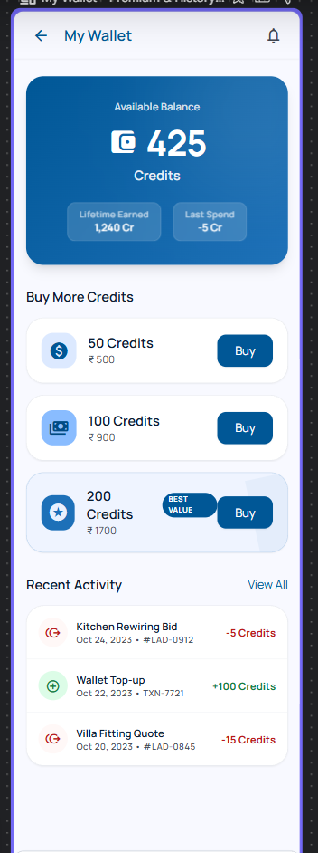
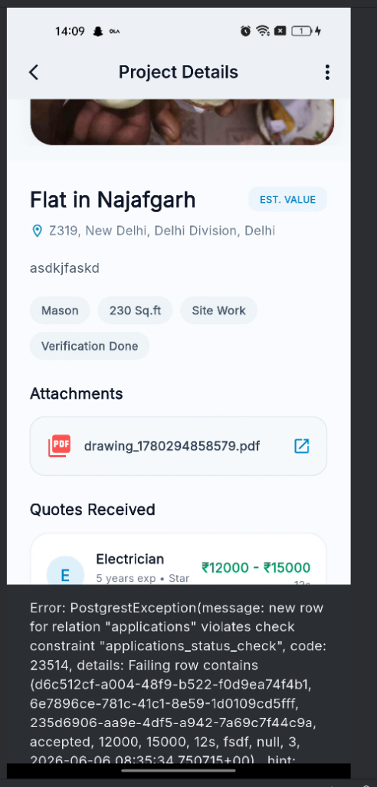
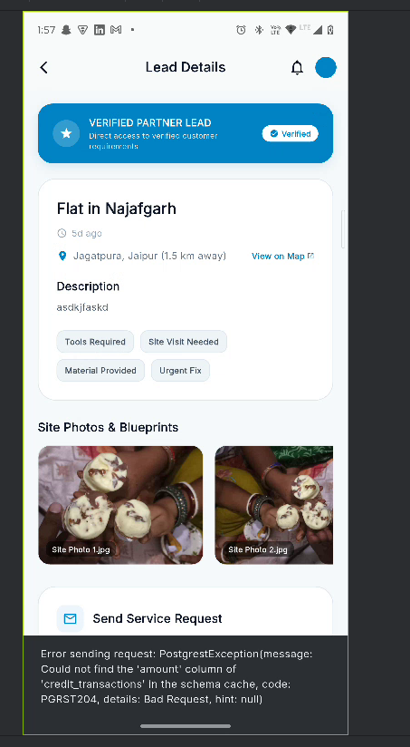
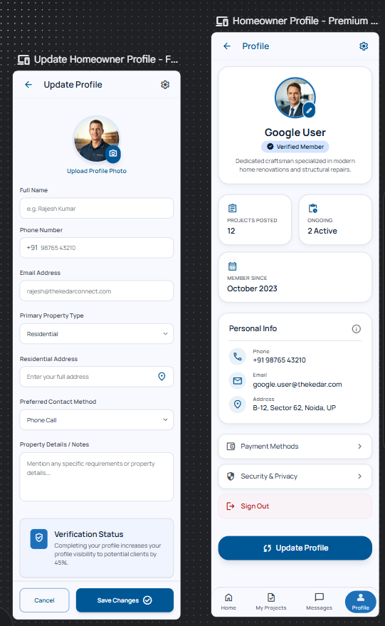
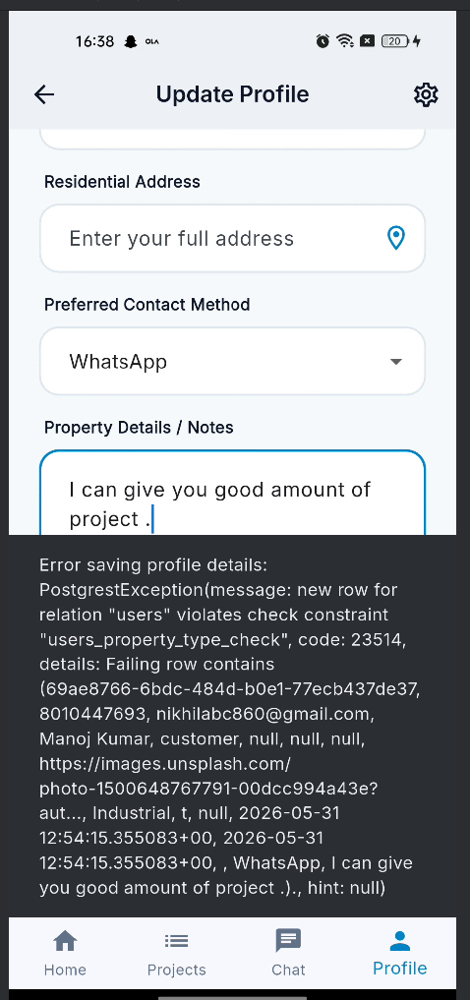
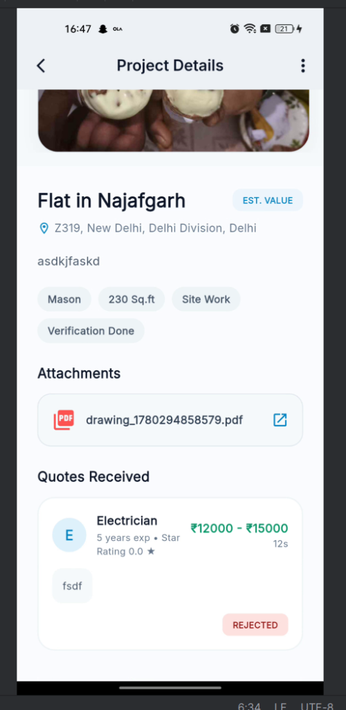
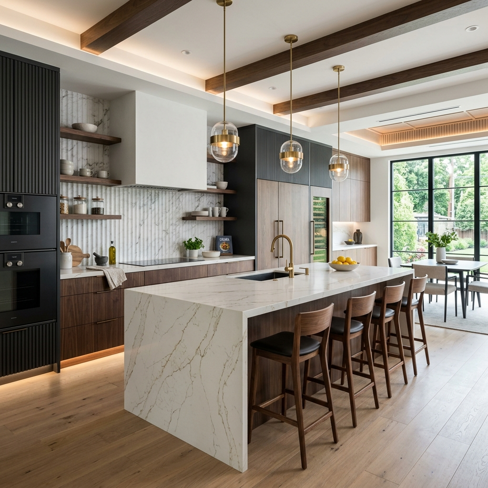

# Thekedar Connect 🚀

[](https://flutter.dev)
[](https://nextjs.org)
[](https://supabase.com)
[](https://www.typescriptlang.org)
[](https://tailwindcss.com)

**Thekedar Connect** is a SaaS-grade marketplace and command ecosystem connecting customers with contractors and handymen. The ecosystem contains a feature-rich Flutter-based mobile application (for both customers and contractors) and a premium, responsive Next.js 15 Web Admin Dashboard that acts as the central control center. All components sync instantly via Supabase database streams and realtime synchronization architecture.

---

## 📸 Project Gallery

### 📱 Flutter Mobile Application
The mobile application dynamically shifts interfaces based on user roles and features interactive animations, beautiful shimmer skeletons, and real-time state synchronization.

| Premium Wallet Screen | Custom Skeleton Loader | Profile Setup |
|:---:|:---:|:---:|
|  |  |  |

| Chat / Project Details | Lead Feed | Role Selection |
|:---:|:---:|:---:|
|  |  |  |

### 💻 Web Admin Dashboard
A polished, modern administration portal built for speed, real-time analytics, user audits, Remote Feature Flags, and CMS management.



---

## 🛠️ Architecture & Core Features

```
Tekdarr/ (Workspace Root)
├── thekedar_connect/     # Flutter Mobile App (iOS / Android)
└── admin_dashboard/      # Next.js 15 Web Control Panel (TypeScript / Tailwind)
```

### 1. Flutter Mobile App (`thekedar_connect`)
*   **Role-Based Bottom Navigation**: Smooth and intelligent UI routing separating Customer and Contractor menus. Resolves caching conflicts when switching roles instantly.
*   **Dynamic Database Theme Engine**: Configured to stream remote theme tokens from the database and apply themes dynamically without app restarts.
*   **Premium Custom Shimmer Loaders**: Elegant skeleton screen list cards loaded with custom shimmer transitions to prevent abrupt UI flashes.
*   **Wallet & Bid System**: Complete contractor financial wallet showing spend logs, balance top-ups, and project bidding statistics.

### 2. Next.js Web Admin Dashboard (`admin_dashboard`)
*   **Executive Metrics Panel**: Realtime dashboard displaying DAU, revenue trends, live support tickets, and active session telemetry.
*   **CMS & Announcement Controls**: Dynamically manage home banners, layout sliders, and system-wide broadcast updates.
*   **Remote Feature Flags & Configuration**: Toggle entire modules (e.g. Chat, Stories) remotely with immediate updates sent to client applications.
*   **Audit Logging**: Immutable system logging recording administrative operations to prevent unauthorized updates.

---

## 🚀 Getting Started

### 📋 Prerequisites
*   [Flutter SDK](https://docs.flutter.dev/get-started/install) (v3.x or higher)
*   [Node.js](https://nodejs.org/) (v20.x or higher)
*   [Supabase account](https://supabase.com) and active DB project

---

### 📱 Running the Mobile App

1. Navigate to the mobile project directory:
   ```bash
   cd thekedar_connect
   ```
2. Install dependencies:
   ```bash
   flutter pub get
   ```
3. Run code generators (for Supabase & models if configured):
   ```bash
   flutter pub run build_runner build --delete-conflicting-outputs
   ```
4. Build or launch the app:
   ```bash
   flutter run
   ```

---

### 💻 Running the Web Admin Dashboard

1. Navigate to the web admin project directory:
   ```bash
   cd admin_dashboard
   ```
2. Copy environment template and define your Supabase variables:
   ```bash
   cp .env.example .env.local
   # Fill in NEXT_PUBLIC_SUPABASE_URL and NEXT_PUBLIC_SUPABASE_ANON_KEY
   ```
3. Install dependencies:
   ```bash
   npm install
   ```
4. Launch the local development server:
   ```bash
   npm run dev
   ```
5. Open [http://localhost:3000](http://localhost:3000) to view the dashboard.

---

## 🛡️ License

This project is proprietary and confidential. Unauthorized copying, distribution, or modifications are strictly prohibited.
